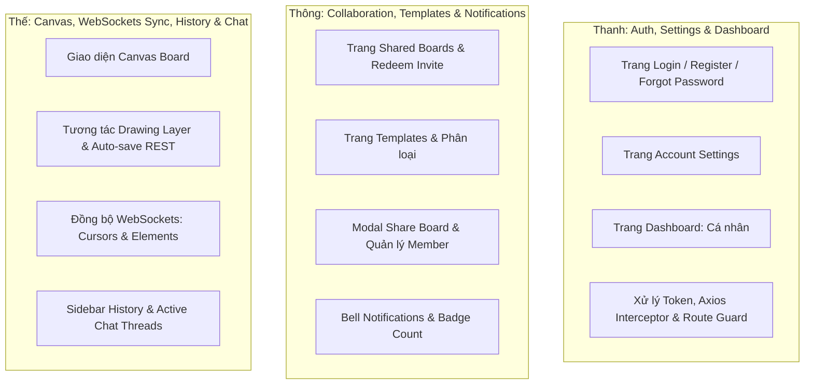

# Kế hoạch Phân công Công việc dự án Sefirah Board

Dựa trên tài liệu [API.md](file:///D:/ProgrammingProjects/sefirah/API.md) và các hình ảnh thiết kế trong thư mục [design](file:///D:/ProgrammingProjects/sefirah/design), dưới đây là kế hoạch phân chia công việc chi tiết cho nhóm phát triển. 

* **Backend**: Bạn (User) phụ trách toàn bộ.
* **Frontend**: Thành viên Thanh, Thông, và Thế phụ trách theo các module cụ thể dưới đây.

---

## 📊 Sơ đồ Phân công Frontend (Thanh, Thông, Thế)

---

## 👤 Chi tiết Công việc của Từng Thành viên

### 1. Thanh: Authentication, Account Settings & Dashboard Core
*Phụ trách xây dựng hạ tầng cơ bản của Frontend (Routing, API Interceptor) cùng các trang thiết lập và màn hình chính.*

* **Màn hình thiết kế đảm nhiệm:**
  * `Login - Sefirah Board.png`
  * `Register - Sefirah Board.png`
  * Trang Quên mật khẩu & Đặt lại mật khẩu (theo luồng API)
  * `Account Settings.png`
  * `Dashboard - My Workspaces.png` (phần Board cá nhân)
* **API Domains tích hợp (theo [API.md](file:///D:/ProgrammingProjects/sefirah/API.md)):**
  * **Domain 1: Authentication (`/api/v1/auth`)**: Đăng ký, đăng nhập (nhớ mật khẩu), đăng nhập mạng xã hội (Google, GitHub), quên/đặt lại mật khẩu.
  * **Domain 2: User & Account Settings (`/api/v1/users`)**: Lấy thông tin cá nhân, cập nhật profile (name, avatar), đổi mật khẩu, bật tắt preferences (nhận email, hiện cursor), xóa tài khoản.
  * **Domain 3: Board Management (`/api/v1/boards`)**: Lấy danh sách board cá nhân (`GET /?type=personal`), tạo board mới, xóa board, sửa thông tin cơ bản.
* **Nhiệm vụ kỹ thuật cụ thể:**
  1. Cấu hình Router (`react-router-dom`) và viết component `PrivateRoute` bảo vệ các route cần đăng nhập.
  2. Thiết lập Axios client, xử lý lưu trữ JWT (`access_token`, `refresh_token`) vào `localStorage` và tự động refresh token qua Interceptor khi mã token cũ hết hạn (`POST /refresh-token`).
  3. Xây dựng giao diện Login/Register có xác thực dữ liệu đầu vào (Regex Email, độ dài mật khẩu) và tích hợp các nút OAuth (Google/GitHub).
  4. Triển khai trang Settings với các form chỉnh sửa thông tin cá nhân, đổi mật khẩu và toggle preferences.
  5. Dựng Layout chung cho Dashboard (Sidebar điều hướng, Header chứa Avatar/Bell).

---

### 2. Thông: Shared Workspaces, Templates, Share Modal & Notifications
*Phụ trách các tính năng tương tác xã hội, chia sẻ không gian làm việc, sử dụng template mẫu và hệ thống thông báo.*

* **Màn hình thiết kế đảm nhiệm:**
  * `Shared - Simplified Nav.png` (Danh sách Board được chia sẻ + Thẻ Redeem Invite)
  * `Templates - Simplified Nav.png` (Danh sách Templates lọc theo danh mục)
  * Modal Share (Khi click nút "Share" trên Header của Canvas)
  * Dropdown danh sách Notifications (Khi click vào biểu tượng Bell ở Header)
* **API Domains tích hợp (theo [API.md](file:///D:/ProgrammingProjects/sefirah/API.md)):**
  * **Domain 4: Templates (`/api/v1/templates`)**: Lấy danh sách template (phân trang, lọc theo category), xem chi tiết template.
  * **Domain 5: Collaboration & Sharing (`/api/v1/boards/:boardId/collaborators`)**: Lấy danh sách thành viên board, mời thành viên qua email, tạo link/mã mời chia sẻ, đổi quyền (Viewer/Editor), xóa thành viên, nhập mã mời (`/invites/redeem`).
  * **Domain 9: Notifications (`/api/v1/notifications`)**: Lấy danh sách thông báo (phân trang, đọc/chưa đọc), lấy số lượng chưa đọc (`/unread-count`), đánh dấu đã đọc một/tất cả, xóa thông báo.
* **Đồng bộ Real-time (WebSockets):**
  * Lắng nghe sự kiện `notification` từ WebSocket để cập nhật tức thời số lượng thông báo chưa đọc (bell badge) và hiển thị thông báo toast mà không cần reload.
* **Nhiệm vụ kỹ thuật cụ thể:**
  1. Thiết kế trang Templates hiển thị danh sách dạng grid, thanh filter theo danh mục (Flowcharts, Brainstorming, Design Systems,...), nút chọn template để khởi tạo board (`POST /boards` truyền kèm `templateId`).
  2. Triển khai trang Shared Boards hiển thị danh sách Board do người khác chia sẻ (có thông tin "Shared by...") và thẻ "Redeem Invite" cho phép nhập code để tham gia board.
  3. Xây dựng Modal Share hiển thị danh sách cộng tác viên hiện tại kèm dropdown đổi quyền (`Viewer` / `Editor`) hoặc xóa quyền truy cập. Thêm form nhập email để mời và khu vực copy link chia sẻ.
  4. Triển khai component Dropdown Notification hiển thị danh sách các hoạt động (được mời, comment mới, nhắc tên, cập nhật board) kèm tính năng đánh dấu đã đọc hoặc xóa thông báo.

---

### 3. Thế: Real-time Canvas Workspace, History & Comments
*Phụ trách phần cốt lõi của ứng dụng - Canvas vẽ tương tác thời gian thực, đồng bộ WebSocket và lưu lịch sử chỉnh sửa.*

* **Màn hình thiết kế đảm nhiệm:**
  * `Workspace - Real-time Canvas.png` (Không gian vẽ chính, Sidebar Tools, Properties Panel, History Panel, Chat Panel)
* **API Domains tích hợp (theo [API.md](file:///D:/ProgrammingProjects/sefirah/API.md)):**
  * **Domain 6: Canvas State REST API (`/api/v1/boards/:boardId/canvas`)**: Tải danh sách element khi bắt đầu mở board (`GET /elements`), sao lưu toàn bộ canvas dạng Snapshot (`PUT /snapshot`) khi WebSocket bị ngắt kết nối.
  * **Domain 7: Board History (`/api/v1/boards/:boardId/history`)**: Lấy danh sách lịch sử phiên bản (`GET /`), xem chi tiết và khôi phục về phiên bản cũ (`POST /restore`).
  * **Domain 8: Active Threads / Chat (`/api/v1/boards/:boardId/threads`)**: Lấy các thread chat, tạo thread ghim vào element, reply thread, resolve thread.
  * **Domain 3 (Nâng cao)**: Tải ảnh chụp canvas lên server làm thumbnail (`POST /:boardId/thumbnail`), xuất file định dạng PNG/PDF/SVG (`POST /:boardId/export`).
* **Đồng bộ Real-time (WebSockets - `/workspace` namespace):**
  * **Room Management**: `join-room` (FE phát), `user-joined` / `user-left` (FE lắng nghe để hiển thị avatar người dùng trực tuyến).
  * **Cursor Sync**: `cursor-move` (FE phát, cần throttle ~50ms), `cursor-moved` (FE lắng nghe để render con trỏ chuột của người khác kèm tên).
  * **Element Sync**: Gửi và nhận các sự kiện `element-create`, `element-update`, `element-delete` để vẽ lại/đồng bộ tức thời các hình khối trên màn hình của tất cả các thành viên trong phòng.
* **Nhiệm vụ kỹ thuật cụ thể:**
  1. Tích hợp thư viện đồ họa Canvas (khuyên dùng **Fabric.js** hoặc sử dụng trực tiếp SVG/HTML5 Canvas tự dựng phù hợp với React) để vẽ và tương tác với các element (hình dạng, thẻ card, sticky note, connector kết nối).
  2. Triển khai thanh công cụ (Shapes, Sticky notes, Text, Connectors, Delete, Move) và bảng thuộc tính (Properties Panel) để đổi màu fill, viền, cỡ chữ của phần tử đang chọn.
  3. Viết tầng kết nối Socket.io kết hợp `SocketProvider` để xử lý việc đồng bộ con trỏ và đồng bộ cập nhật element thời gian thực. Sử dụng `lodash.throttle` giới hạn tần suất gửi tọa độ chuột.
  4. Triển khai tính năng Undo/Redo cục bộ (sử dụng stack) phối hợp nhịp nhàng với luồng WebSocket để tránh xung đột dữ liệu.
  5. Xây dựng Sidebar History hiển thị danh sách các phiên bản (Auto-save/Restore) và cho phép người dùng click để xem trước hoặc áp dụng khôi phục phiên bản.
  6. Thiết kế bong bóng bình luận (comment bubble) đính kèm trên từng element và Panel Chat hiển thị chi tiết các cuộc hội thoại, trả lời hoặc đánh dấu giải quyết xong (resolved).
  7. Tự động chụp màn hình canvas thành ảnh và gửi lên API Thumbnail khi người dùng thoát board hoặc định kỳ 2 phút. Tích hợp nút Export xuất bản vẽ.

---

## 🛠️ Trách nhiệm của Backend (User)

Để hỗ trợ Frontend phát triển trơn tru, bạn cần chuẩn bị sẵn sàng các tài nguyên sau:
1. **Thiết lập database & Prisma**: Tạo schema tương thích với các model tại [Models.ts](file:///D:/ProgrammingProjects/sefirah/packages/shared/Models.ts).
2. **Triển khai REST API đầy đủ**: Cung cấp các endpoint theo đúng cấu trúc payload và response của [API.md](file:///D:/ProgrammingProjects/sefirah/API.md).
3. **Triển khai WebSocket Server**: Socket.io server lắng nghe namespace `/workspace`, xử lý chia phòng (room) theo `boardId` để truyền phát (broadcast) chính xác các sự kiện cursor và element sync.
4. **Cấu hình OAuth**: Đăng ký Google / GitHub Developer Console và điền thông tin vào `apps/backend/.env` để Frontend chạy thử nghiệm.

---

## 🤝 Quy trình Phối hợp Nhóm (Git Flow)

Cả nhóm cần tuân thủ nghiêm ngặt quy trình được mô tả trong [COMMIT.md](file:///D:/ProgrammingProjects/sefirah/COMMIT.md):

1. **Nhánh gốc**: Tất cả mọi người bắt đầu từ nhánh `develop`. Tuyệt đối không push trực tiếp lên `develop`.
2. **Đặt tên nhánh**: Khi làm tính năng mới, tạo nhánh theo định dạng: `feat/tên-tính-năng`
   * Ví dụ Thanh làm login: `feat/auth-login-page`
   * Ví dụ Thông làm template: `feat/templates-gallery`
   * Ví dụ Thế làm cursor sync: `feat/canvas-cursor-sync`
3. **Mã nguồn chung**: Các cấu trúc dữ liệu, interface TypeScript dùng chung cho cả FE và BE cần được định nghĩa hoặc cập nhật trong package shared [Models.ts](file:///D:/ProgrammingProjects/sefirah/packages/shared/Models.ts) để tránh lệch kiểu dữ liệu.
4. **Tạo Pull Request (PR)**:
   * Sau khi làm xong trên local, push nhánh lên github (`git push --set-upstream origin <tên-nhánh>`).
   * Tạo Pull Request từ nhánh của mình vào nhánh `develop`.
   * **Thông báo cho Backend (User)** qua Zalo để review và merge. Thành viên không được tự ý merge code của mình.
